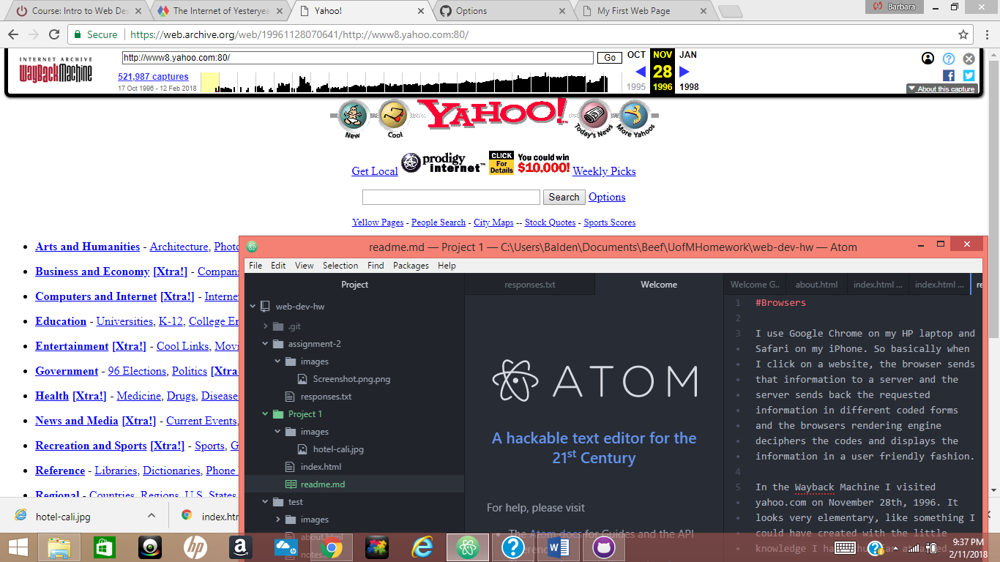

#Browsers

I use Google Chrome on my HP laptop and Safari on my iPhone. So basically when I click on a website, the browser sends that information to a server and the server sends back the requested information in different coded forms and the browsers rendering engine deciphers the codes and displays the information in a user friendly fashion.

In the Wayback Machine I visited yahoo.com on November 28th, 1996. It looks very elementary, like something I could have created with the little knowledge I have thus far attained. Today yahoo.com looks like Times Square with its advertisements, flashy headlines, and visually appealing content. It has indeed come a long way.

This assignment was easier than the last one although I'm not entirely sure why. The last assignment threw me off toward the end and I believe I saved something where I wasn't supposed to or created a file/folder I wasn't supposed to and from that moment on I was lost. This time it was easier to follow along and the screen shot tutorials sure make things easier also. It is confusing at first but just like anything else, the more you do it, the better you get!

 
