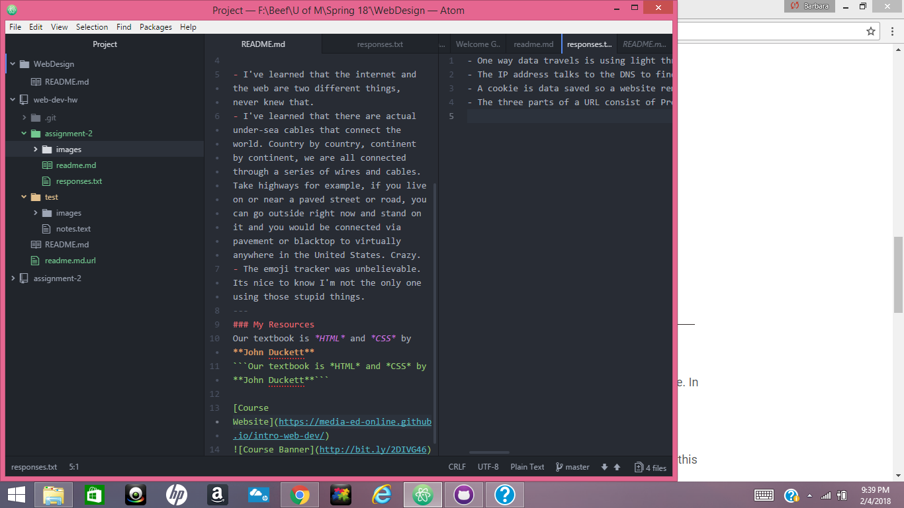

# Assignment 2

A Version Control System allows for changes to be made to files. It also allows for collaboration between users. It lets us track changes throughout our assignments.

This assignment was difficult because I dont understand the terminology quite yet but I am getting the hang of updating in ATOM and pushing it to Github. I just need a litte more experience to become efficient. 

[My responses](./responses.txt)

My [Course notes](./notes.text)

