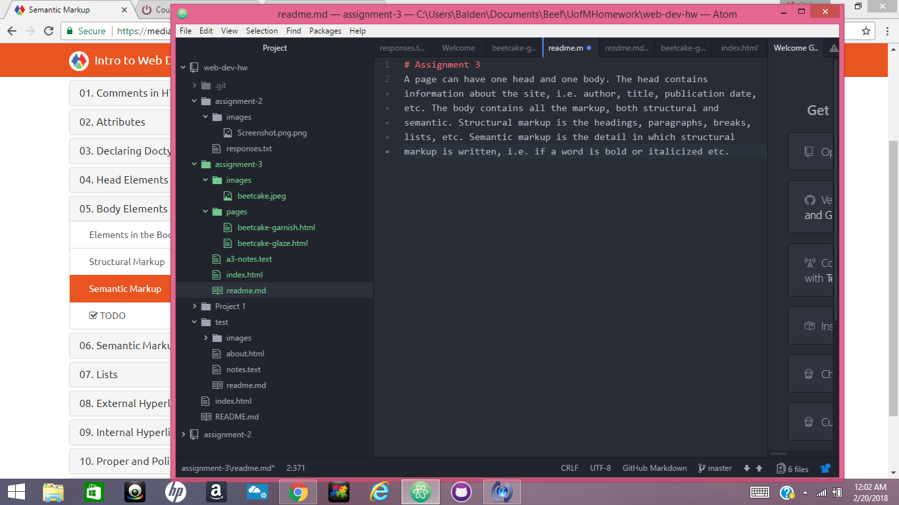

# Assignment 3
A page can have one head and one body. The head contains information about the site, i.e. author, title, publication date, etc. The body contains all the markup, both structural and semantic.

Structural markup is the headings, paragraphs, breaks, lists, etc. Semantic markup is the detail in which structural markup is written, i.e. if a word is bold or italicized etc.

This assignment was time consuming. A lot of attention must be paid to the details when using semantic markup. Once I got the hang of it (after about 4 hours) it began to become uderstandable.

 
