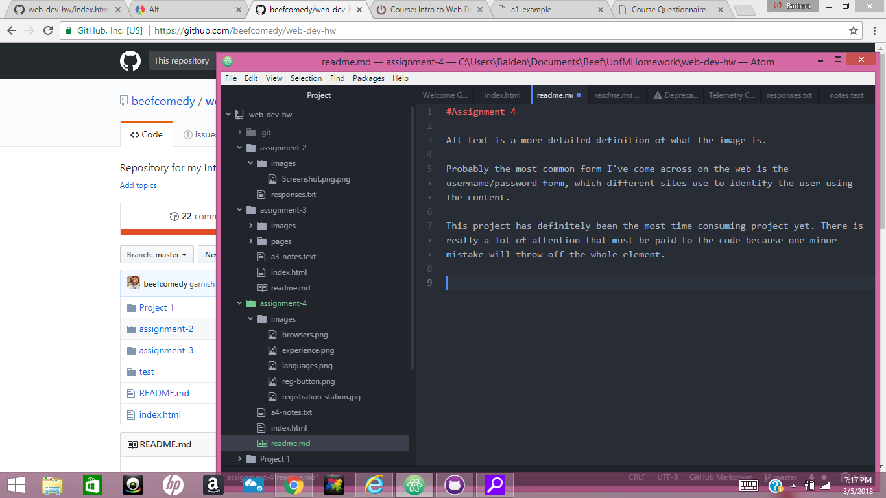

#Assignment 4

Alt text is a more detailed definition of what the image is.

Probably the most common form I've come across on the web is the username/password form, which different sites use to identify the user using the content.

This project has definitely been the most time consuming project yet. There is really a lot of attention that must be paid to the code because one minor mistake will throw off the whole element.

 
