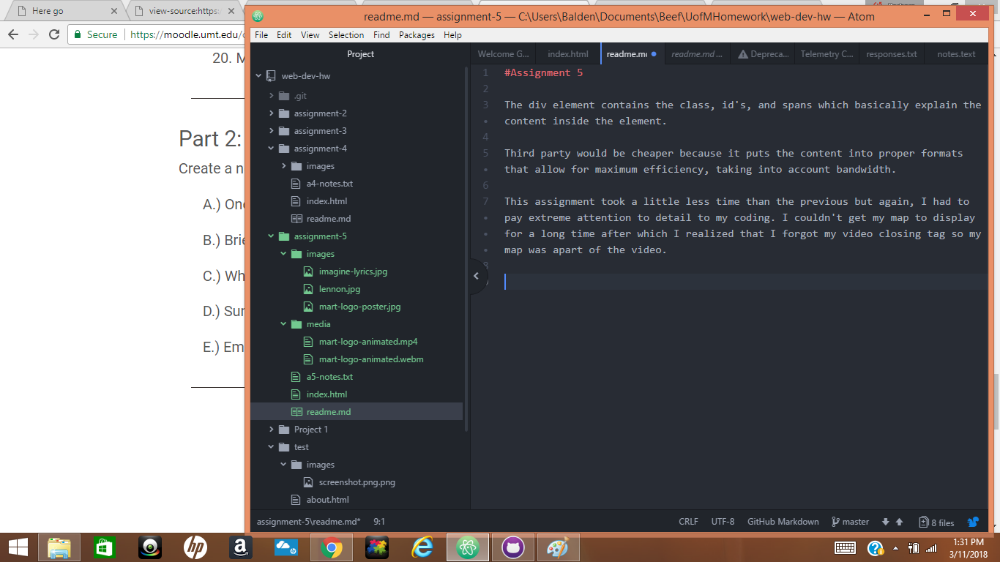

#Assignment 5

The div element contains the class, id's, and spans which basically explain the content inside the element.

Third party would be cheaper because it puts the content into proper formats that allow for maximum efficiency, taking into account bandwidth.

This assignment took a little less time than the previous but again, I had to pay extreme attention to detail to my coding. I couldn't get my map to display for a long time after which I realized that I forgot my video closing tag so my map was apart of the video.

