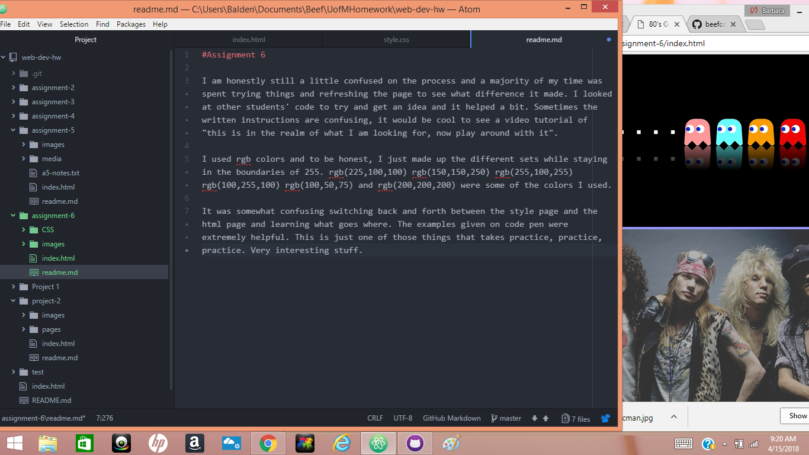

#Assignment 6

I am honestly still a little confused on the process and a majority of my time was spent trying things and refreshing the page to see what difference it made. I looked at other students' code to try and get an idea and it helped a bit. Sometimes the written instructions are confusing, it would be cool to see a video tutorial of "this is in the realm of what I am looking for, now play around with it".

I used rgb colors and to be honest, I just made up the different sets while staying in the boundaries of 255. rgb(225,100,100) rgb(150,150,250) rgb(255,100,255) rgb(100,255,100) rgb(100,50,75) and rgb(200,200,200) were some of the colors I used.

It was somewhat confusing switching back and forth between the style page and the html page and learning what goes where. The examples given on code pen were extremely helpful. This is just one of those things that takes practice, practice, practice. Very interesting stuff.

 
