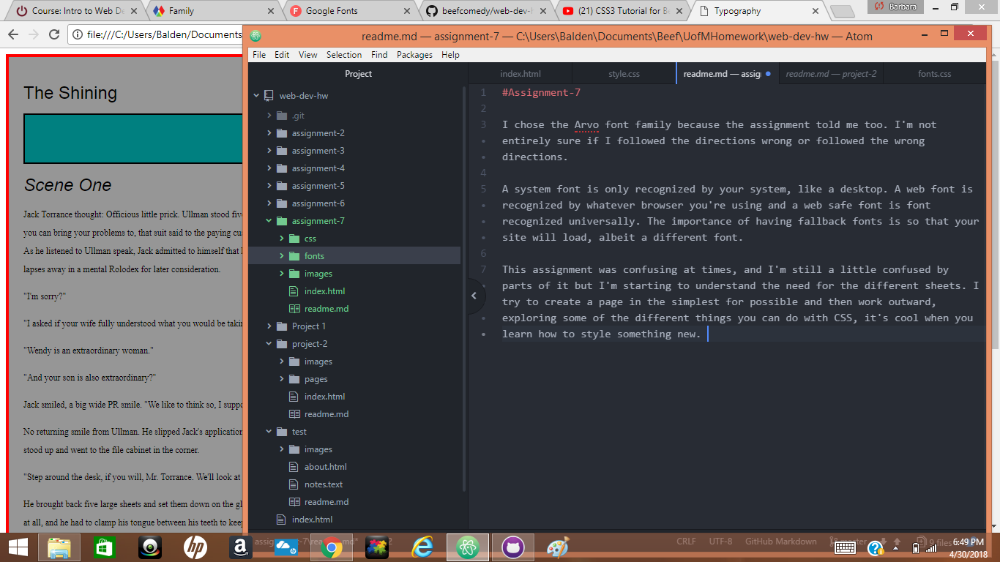

#Assignment-7

I chose the Arvo font family because the assignment told me too. I'm not entirely sure if I followed the directions wrong or followed the wrong directions.

A system font is only recognized by your system, like a desktop. A web font is recognized by whatever browser you're using and a web safe font is font recognized universally. The importance of having fallback fonts is so that your site will load, albeit a different font.

This assignment was confusing at times, and I'm still a little confused by parts of it but I'm starting to understand the need for the different sheets. I try to create a page in the simplest for possible and then work outward, exploring some of the different things you can do with CSS, it's cool when you learn how to style something new.

