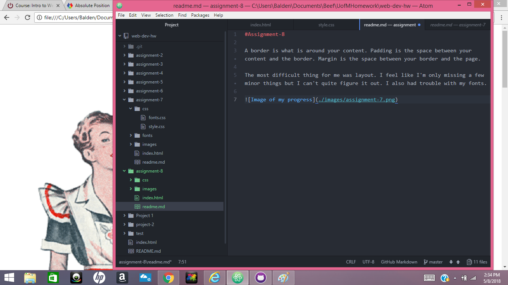

#Assignment-8

A border is what is around your content. Padding is the space between your content and the border. Margin is the space between your border and the page.

The most difficult thing for me was layout. I feel like I'm only missing a few minor things but I can't quite figure it out. I also had trouble with my fonts.

