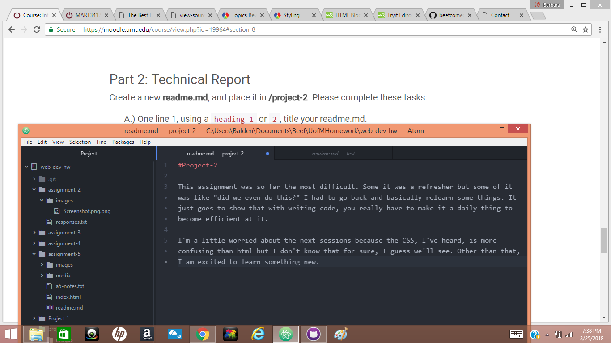

#Project-2

This assignment was so far the most difficult. Some it was a refresher but some of it was like "did we even do this?" I had to go back and basically relearn some things. It just goes to show that with writing code, you really have to make it a daily thing to become efficient at it.

I'm a little worried about the next sessions because the CSS, I've heard, is more confusing than html but I don't know that for sure, I guess we'll see. Other than that, I am excited to learn something new.

